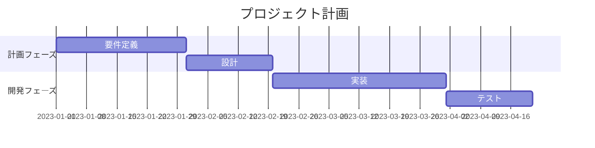

今回のアップデートで以下の機能が追加しました：

- [Mermaid](https://mermaid.js.org/) 図表作成：コードブロックから自動的に図表を生成
- 読了時間表示：記事の文字数から推定読了時間を計算
- 目次（TOC）：自動生成の目次

## ざっくり実装ログ

以下の追加

### mermaid

mermaid はインポートした mermaid の機能を呼び出すだけでコンパイルされる

### 読了時間

```c
関数 計算読了時間(テキスト):
クリーンテキスト = HTML タグを除去(テキスト)
クリーンテキスト = 改行を除去(クリーンテキスト)
文字数 = 文字をカウント(クリーンテキスト)

    もし 文字数 < 800 なら:
        戻る "1分で読めます"
    そうでなければ:
        読了分数 = 四捨五入(文字数 ÷ 400)
        戻る "約" + 読了分数 + "分で読めます"
```

### 目次

```c
もし　記事の文字数が360文字以上なら：
toc.htmlの関数から目次を生成
```

### mermaid 使用例


