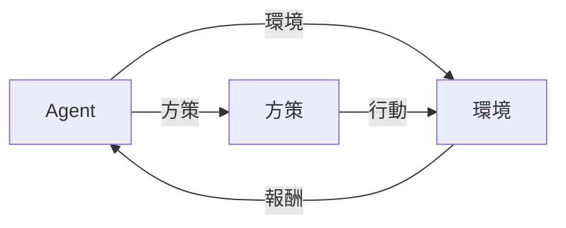

強化学習のサーベイ論文（2023）

## DQN

Deep Q Network が 2015 に登場し，教師なし学習の一種である（深層）強化学習は一斉に研究される用になった．

### RL（強化学習）

Agent が環境との相互作用の中で試行錯誤を繰り返し，報酬を最大化する中で最適な方策を学ぶアルゴリズム．

#### MDP（マルコフ決定過程）

行動を実行した後，エージェントは報酬$r_{t+1}$を受け取り，報酬関数$R(s_t, a_t, s_{t+1})$および遷移分布$P(s_{t+1}|s_t, a_t)$に従って次の状態$s_{t+1}$に遷移する．

マルコフ決定過程

強化学習の概念図

1. Agent は環境に対して行動を起こし，環境が次状態に移行することにより報酬を得る．
2. この報酬から Agent は方策を更新する．
3. この過程を繰り返し，報酬を最大化するような方策を学習する．

時刻$t$から相互作用終了までのリターンは，

$$
G_t = \sum_{i=0}^{\infty} \gamma^i r_{t+i}
$$

ここで$\gamma \in [0, 1]$は割引率である．

この式により，直近の報酬を重視するのではなく，長期的な報酬を最大化するような方策を学習する．
このリターンを最大化することにより，エージェントは環境に対して最適な方策を学習する．

### DRL（深層強化学習）

上記の強化学習の方策を NN（ニューラルネットワーク）を用いて表現する方法．
NN を用いることにより例えば非線形な，より複雑な環境に対する報酬を表現することが可能である．

1. 高次元かつ大規模な状態空間を扱う．
2. ラベル付きデータセットが必要でない．
3. オフライン学習が可能になる（すでに集めたデータだけで環境を使わず学習できる．）

> ロボットや医療現場では何度も環境との相互作用を繰り返すことが難しい．
> 環境行動報酬次状態のデータから学習する → オフライン学習

#### DRL の種類

##### モデルあり DRL

モデルあり DRL は，遷移モデルや報酬モデルを知っている or 学習によって得る．つまり，ダイナミクスモデルを学習して，再現する．

学習したモデルをもとにポリシーを学習する．（MB-MPO, ME-TRPO）
既知のモデルに基づいて計画を立て，ポリシーのみ学習する（動的計画法，AlphaZero）

これらは環境を実際に遷移させなくてもモデルを学習することができる．

##### モデルなし DRL

1. 価値ベース
   - 状態ー行動の価値関数$Q(s, a)$を学習する．（Q 学習）
   - 価値関数を用いてポリシーを学習する．
2. 方策ベース
   - 方策を直接学習し，そこから行動を選択する．
   - 連続行動空間や確率的ポリシーにも対応，分散が大きい問題がある．
   - 報酬が大きくブレるような設定において，ポリシーの学習が不安定になる．
3. アクタークリティック
   - 方策の「アクター」と価値関数の「クリティック」を学習する．（PPO，SAC，TD3）

##### Q 学習

Q 学習は，価値関数を用いてポリシーを学習する．

$$
Q(s_t, a_t) \leftarrow Q(s_t, a_t) + \alpha (r_{t+1} + \gamma \max_{a_{t+1}} Q(s_{t+1}, a_{t+1}) - Q(s_t, a_t))
$$

ここで，$\alpha$は学習率，$\gamma$は割引率である．

最大の特徴は，将来の報酬が最大だと仮定している点．

##### オンポリシーとオフポリシー

オンポリシー（on-policy）：訓練データ生成に用いた方策（行動方策）と，学習対象の方策（ターゲット方策）が同じ．安定性が高いがサンプル効率が低い．

オフポリシー（off-policy）：行動方策とターゲット方策が異なる．デモデータ活用やサンプルの再利用が可能だが，安定性や収束性に課題がある．

> 実際に環境を動かしながらやるか？という違いがある

### 計算量の推移

より複雑な訓練プロセスでは時間やリソースが多く必要となる．

DQN を Atari2600 で訓練するには 38 日分の体験データ（5000 フレーム）が必要．
学習も時間を要し，ハイパーパラメータの調整も困難．

atari 2600

> ファミコンみたいなもの．中にいわゆるアーケードゲームが入っている 👾

DRL の訓練を加速させるために並列計算および分散計算を利用することが直感的な解決策となる．
しかし発展は複雑で急速である．
従ってこの論文でまとめる．

## 分散訓練

基本的には AI 友達なので，深層学習の分散の考えが深層強化学習にも適用できる．

### データ並列

訓練データを複数のワーカに分割，各ワーカが隔週したパラメータを同期する．

### モデル並列

モデルを分割し，各部分を異なるワーカで学習する．計算依存性が高いため並列化が難しい．なんで．

### パイプライン並列

モデルを複数のステージに分けて順次学習する．

> 併せ技も提案されている．

DRL の分散訓練に DL の分散技術をそのまま使うのはちょっと問題がある

- Agent,Env,パラメータサーバなどが強調するため，アーキテクチャ設計と分配が難しい．
- デバイス間データ転送が多く，スループットが下がりやすい
- 並列環境では処理速度が異なるので古い勾配で学習してしまうと収束性が下がる

### DRL の分散訓練のアーキテクチャ（パーツ）

- **Actor**：環境と相互作用し，方策に従って行動し，観測や報酬などの情報を取得し，経験データを生成する役割．
- **Learner**：経験データを収集またはサンプリングし，モデル更新のための勾配を計算する．GPU のような高速ハードウェアがしばしば用いられる．
- **パラメータサーバ（Parameter Server）**：Actor や Learner のためにニューラルネットワークの最新パラメータを保持する役割．一部の方式では，Learner がこの役割を兼ねる場合もある（例：APE-X や R2D2）．
- **リプレイメモリ（Replay memory）**：Actor が生成した経験データを保存する場所．これはオフポリシー強化学習において使用される（例：Gorila，Ape-X，R2D2）．

#### 集中型アーキテクチャ

学習用のニューラルネットワークのグローバルモデルを 1 つの中心ノードが保持する．Learner は Actor からの経験をもとに勾配を計算してこのモデルを最適化する．Learner および Actor は，定期的にこのグローバルモデルと同期する．中心ノードはパラメータサーバか Learner が担当する．

##### GOOD

- 設計が容易
- 同期が容易

##### BAD

- 中心ノードへの負荷が大きい

- Gorila
  - 多数の Actor と Learner で訓練を並列化
- Ape-X
  - 経験の優先度付きサンプリングにより効率化
  - パラメータ更新は GPU 上の単一 Learner が担当．バッチ処理．
- R2D2
  - LSTM による部分観測環境への対応
- A3C
  - Actor と Learner を 1 つのスレッドにまとめる．

#### 分散型アーキテクチャ

中心ノードを持たず，複数の Learner がそれぞれ自分の Actor からの経験に基づいて勾配を計算し，お互いに勾配を共有することでモデルを更新する．「All-reduce」と呼ばれる通信方式を用い，パラレルワーカー間で完全に接続されたトポロジーが必要となる．

##### 概要

- IMPALA
  - CPU で環境との相互作用を行う Actor と，GPU で学習を行う Learner で構成．
  - Learner 間で勾配を同期し，Actor は Learner から最新パラメータを受け取る．
- rlpyt（Stooke ら）：
  - 複数 GPU を用いた並列化
  - GPU がデータのサンプリングと推論を実行，ALL-reduce で共有
- DD-PPO
  - 複数マシンへの拡張

##### GOOD

- 中心ノードがないためスケーラブル

##### BAD

- 勾配共有に時間がかかり通信オーバーヘッドが大きい

### シミュレーションの並列性

環境との相互作用でデータを集めるという点が DRL の大きな特徴である．
現実を模倣したシミュレーションにより，効率的な訓練が行われることが多い．

#### CPU クラスタを用いた並列（ナイーブな手法）

CPU クラスタを用いて分散実行する．

- システム全体の CPU コア数にスケーラビリティが依存する
- ノード間通信・同期・リソース割り当てにオーバーヘッドがある
- CPU・GPU 間でのデータ転送がオーバーヘッドとなる

#### GPU・TPU によるバッチシミュレーション

### 推論やバックプロパゲーションの並列化

### クラスタコンピューティング

### 単一マシン並列処理

### 専用ハードウェアアーキテクチャ

### 分散における同期

#### 非同期オフポリシー訓練

#### 同期オンポリシー訓練

#### Discussion

### 進化型深層強化学習

#### GOOD

#### BAD
