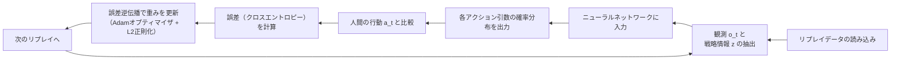
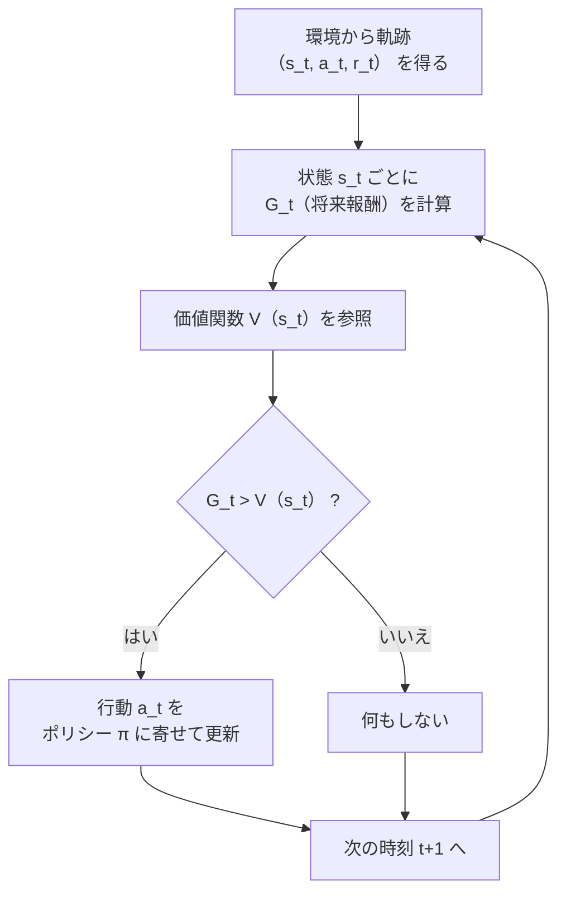
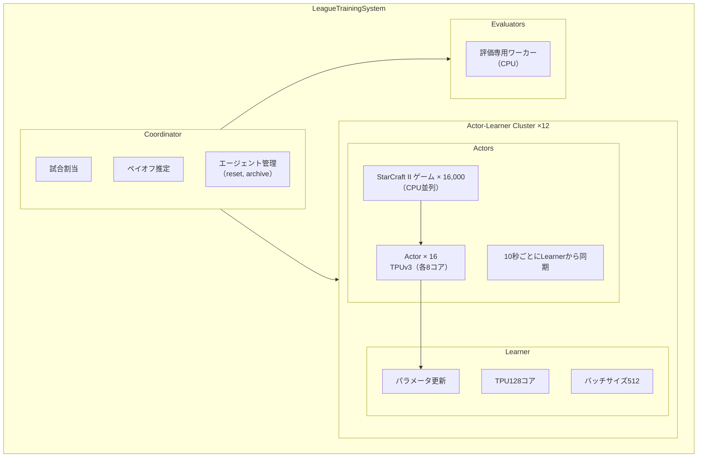

# 強化学習で StarCraft をクリア(トップランク到達)する＠Nature 誌

## Abstract

AI が複雑な環境での協調や競合する能力が試されている．StarCraft はプロ e スポーツの中でも最も困難なゲームとして注目されている．StarCraft における複雑性は，現実世界に通じるものがあると考えられている．

AI の今までの取り組みは，ゲームの要素を簡単化したテストや反応速度の速さを売りにするものだった．従来の AI は，ゲームの構成要素を単純化したり，人間を超える反応速度などの非現実的な能力を用いて性能を上げてきた．しかし本研究では，現実世界への応用可能性を考慮し，人間並みの制約下で複雑性を維持したまま強化学習に取り組んでいる．

提案手法である AlphaStar は 99.8%以上のランク付きプレイヤーを上回る成績を示した．

## StarCraft のゲーム的特徴と AI の課題

### StarCraft II

StarCraftII とは，1 対 1（1v1）のリアルタイムストラテジーゲームであり，プレイヤーは 3 つの種族（Terran，Protoss，Zerg）から 1 つを選ぶ．これらはそれぞれ異なるユニットと建物を持ち，異なるメカニクスや戦略を要求する．また「Random」種族を選ぶと，ゲームがプレイヤーの種族をランダムに決定する
ゲームは，少数の建物と労働ユニットから始まり，資源を集めて新たなユニットや建物を作成し，敵を偵察し，新しいテクノロジーを研究して進行していく．全ての建物が破壊されると敗北となる．

StarCraft II はリアルタイムストラテジーゲームであり，数百のユニットを個別に制御しながら，高度な経済的意思決定と戦術操作を同時に行う必要がある．
このゲームは，以下点で困難である：

- 非推移的かつ循環的な戦略の存在（ある戦略 A が B に勝ち，B が C に勝つが，C が A に勝つような状況）．
- 長期的な計画が必要となるゲーム性（オセロのようにすぐには終了しない）
- 不完全情報：プレイヤーは自軍ユニットによって観測された敵ユニットしか把握できず，一部情報はカメラ外で隠蔽される．
- 膨大な組合せ行動空間：各タイムステップで約 10 の 26 乗通りの行動選択肢が存在する．

AlphaStar はこのような課題に対し，人間と同様の制約（カメラ操作，行動速度，反応遅延）を課した上でプレイするよう設計されている．

### 機械のプレイと人間のプレイはフェアか？

人間 VS 機械のゲームプレイにおいて公平性の普遍的な定義は存在しない．
以下パラメータはプロプレイヤーおよび開発者との協議の上設定した．

- 試合条件
- インターフェース
- カメラビュー
- アクション速度制限
- 遅延

> 1 ステップは 45ms

ゲーム内での**複数のアクションカテゴリ（移動，攻撃，生産，カメラ操作など）**に対して，

- それぞれ異なる重みとクールダウン制限を設定
- 短期間で連続的にアクションを出すことを制限するフィルタを通す（Extended Data Fig. 4 参照）
- 観測 → 思考 → 実行の過程に 400ms 程度の遅延が加わっている

## Environment

観測される環境のパラメータ

- 非空間特徴量
  - 利用可能な資源
  - プレイヤーの人口，最大人口
  - 所持アップグレードや研究状態
  - 現在のゲーム時間
- ユニット表（各ユニットごとに）
  - 種類
  - HP,Shield,Energy
  - 位置
  - 進行中の命令
  - プレイヤー or 敵再度
  - その他
- 空間マップ
  - 地形情報
  - ユニットがいるかどうか
  - 敵味方の分布
  - 影響範囲，視界

これらの情報を Scatter 接続により空間マップ上に配置
さらに LSTM に渡して時系列情報として一貫性を持たせる．

## ニューラルネットワーク構成

スカラー情報　-> 全結合層
ユニット表 -> 自己注意層，LSTM
空間マップ -> CNN

中心となるのが LTSM ベースの「リカレントコア」

状態エンベディング＋前のアクションを入力とし，隠れ層を出力する．

出力は逐次生成な構成である．

1. アクションタイプ（移動，攻撃，建設）を選ぶ
2. 対象ユニットを選ぶ．
3. 位置座標を選ぶ
4. サブコマンドを選ぶ

## 学習アルゴリズム

AlphaStar は，以下のようなポリシーを学習する：
$$\pi_\theta(a_t \mid s_t, z)$$

- $s_t = (o_{1:t}, a_{1:t-1})$ はゲーム開始から時刻 $t$ までの観測と行動の履歴
- $z$ は人間のプレイデータからサンプリングされた戦略の統計情報（例：ビルド順序）
- ニューラルネットワークのパラメータ$\theta$

### 初期訓練：教師あり学習（模倣学習）

初期のパラメータは人間のリプレイデータから教師あり学習の要領で学習される．観測履歴$s_t$および統計情報$z$を入力として，行動$a_t$を出力するような方策$\pi_\theta$を学習する．
MMR（Match Making Rating）が 3,500 を超えるプレイヤーによる，StarCraft II バージョン 4.8.2〜4.8.6 での 971,000 件のリプレイデータを使用した．

> (この戦略 z で，)この状態ならこんなアクションをとるだろうな．このアクションが x%でこれは y％かなという分布

人間の行動とのズレ（クロスエントロピーか KL ダイバージェンス）を参考にロスを計算し，フィードバック

### 強化学習

様々な対戦相手との勝率を最大化するように最適反応を学習するアルゴリズム．

AlphaStar の強化学習は，アクター・クリティック型のポリシー勾配法を基本とし，リプレイされた経験に対して非同期にアップデートを行うオフポリシー学習の形式を取る．これは，現在の方策と過去の方策が長い時間ステップにわたって一致しないという現実に対応するためである．

> 大規模な行動空間においては、現在のポリシーと過去のポリシーが多くのステップにわたって一致する可能性は非常に低い。したがって、我々はミスマッチにもかかわらず効果的に学習できる技術の組み合わせを使用する

- V-trace：クリップ付き重要度サンプリングを用いたオフポリシー補正
- TD(λ)：時間差学習による価値関数更新
- UPGO（Upgoing Policy Gradient Optimization）：平均より良い報酬を得た軌道にポリシーを近づける自己模倣学習の一種

なお，訓練時のみ，方策のばらつきを減らすために対戦相手の視点も用いて価値観数を推定している．

#### V-trace

昔の自分のプレイでも，今の自分の学習に使えるようにズレを補正する方法

過去のポリシーで選択した行動が現在のポリシーでも選択される確率を計算する．
確率が高ければそのまま，低ければ補正 or 影響を弱める．

実際に選ばれた行動と，今のポリシーでの確率比を計算：

$$
\rho_t = \frac{\pi_{\text{current}}(a_t|s_t)}{\pi_{\text{behavior}}(a_t|s_t)}
$$

この $\rho_t$ を使って，学習に反映する影響を調整

- 今の確率が低く，過去が高い → 比率は小さくなる（≪1）
- 今の確率が高く，過去が低い → 比率は大きくなる（≫1）

学習を安定化させるため，この値は上限クリップする．

#### TD(λ)

先の報酬を少しずつ前に伝えてくれる予測学習法．今の状態の価値 $V(s_t)$ を，未来の報酬を見ながら学習する

- 入力：ある時点の状態 $s_t$，そこからの報酬列 $r_{t+1}, r_{t+2}, \dots$
- 出力：$s_t$ の価値 $V(s_t)$ を「もっとこうすべき」と修正

$$
V(s_t) \leftarrow V(s_t) + \alpha \cdot \delta^{(\lambda)}_t
$$

ここで $\delta^{(\lambda)}_t$ は「未来報酬の加重平均からのズレ」

たとえば λ=0.5 のとき：

$$
\text{Target} = 0.5 \cdot \text{1-step} + 0.25 \cdot \text{2-step} + 0.125 \cdot \text{3-step} + … + \text{最後}
$$

#### UPGO（Unreal Policy Gradient with Off-policy corrections）

自己模倣型のポリシー学習手法

> 過去にうまくいった軌跡（行動の流れ）にポリシーを“寄せる”ように学習する

1. TD(λ) で $V(s_t)$ を常に更新（＝未来の予測を整える）
2. UPGO で $G_t > V(s_t)$ なところだけ「これ良かった！」とポリシーを寄せる

UPGO では，軌跡の中で「この行動，実は予想よりも良かった」というポイントにだけ注目して，その行動の選択確率が高くなるようにポリシーを更新する．
この判断には「実際に得られた累積報酬 $G_t$」と「価値関数による期待値 $V(s_t)$」の差が使われる：

- $G_t > V(s_t)$ なら → 「期待以上にうまくいった」とみなす
- → その行動の確率 $\pi(a_t|s_t)$ を 上げるように勾配更新する
- そうでない場合は → 学習の対象から外す（勾配ゼロ）

このように，「うまくいったことだけを強化する」ことにより，報酬がスパースな環境でも効率よく探索・学習できるように設計されている．

$$
\rho_t \left( G_t^U - V_\theta(s_t, z) \right) \nabla_\theta \log \pi_\theta(a_t \mid s_t, z)
$$

ここで，

$$
G_t^U =
\begin{cases}
r_t + G_{t+1}^U & \text{if } Q(s_{t+1}, a_{t+1}, z) \geq V_\theta(s_{t+1}, z) \\
r_t + V_\theta(s_{t+1}, z) & \text{otherwise}
\end{cases}
$$

- \( G_t^U \)：upgoing return
- \( Q(s, a, z) \)：アクション価値関数の推定値
- \( \rho_t \)：clipped importance ratio

$$
\rho_t = \min\left( \frac{\pi_\theta(a_t \mid s_t, z)}{\pi_{\theta^-}(a_t \mid s_t, z)}, 1 \right)
$$

ここで，$\pi_{\theta^-}$ は旧ポリシーを表す．

## マルチエージェント強化学習

### 自己対戦アルゴリズム

チェスや将棋の自己対戦アルゴリズムの学習は早いが，戦略が循環することがある．

> じゃんけんのようになる．ジャンケンの手に一般的な良し悪しはなく，どれも同じだけ強い．

### 仮想自己対戦（Fictitious Self-Play, FSP）

すべての過去のポリシーの一様混合に対するベストレスポンスを学習する．

> 過去のいろんなポリシーのエージェントに対して，平均して一番勝てるポリシーを学ぶ．尖ったポリシーではなく．

2 人ゼロサムゲームにおいてナッシュ均衡への収束が保証される．

> 2 人ゼロサムゲーム：完全に勝ち負けが決まる二人ゲーム．ジャンケン． 
> ナッシュ均衡：どのプレイヤーも，自分の戦略を変えても，自分の利得が減少するような戦略の組合せ．（最強のレベルで均衡している．）

### 拡張された仮想自己対戦

仮想自己対戦を拡張し，一様でない混合戦略に対するベストレスポンスを計算する．多様なエージェントとは，事前に設定されたエージェントとそれらの現在と過去のポリシーを含む集合である．各エージェントは自分専用の混合ポリシーからサンプリングされた相手と対戦する．

- Main Agents
  - 各対戦相手への勝率に応じて混合比率を適応的に調整する．苦手な相手との対戦機会を増やす．固定確率で自分とも戦う．
- Main Exploiters
  - 現在のメインエージェントにのみ対戦を集中させる．メインエージェントの弱点を見つける．
- League Exploiters
  - メインエージェントには狙われず，他の全プレイヤーと対戦するメカニズムを用いる．リーグ全体の弱点を発見する．

## 分散のアーキテクチャ（重要）

16,000 の並列 StarCraft II ゲームと 16 個の actor タスク（それぞれ TPU v3 デバイスを使用し，8 コア）
ゲームは，プリエンプティブ（奪取可能）な CPU 上で非同期に進行し（約 150 台，1 台あたり物理 28 コア），
エージェントステップに対するリクエストは動的にバッチ化されて TPU 上で効率的に処理される．
TPU を用いたバッチ推論は，以前の研究よりも大幅な効率向上をもたらした．
Actor は，観測・行動・報酬の系列をネットワーク経由で中央の Learner に送信する．
Learner は 128 コアの TPU 上で動作する学習ワーカーであり，
受け取ったデータはメモリ上でバッファリングされたのち，**2 回再生（リプレイ）**される．

学習ワーカーは 大規模バッチの同期的更新を行い，
TPU コアごとに 4 系列のミニバッチを処理し，総バッチサイズは 512 となる．

学習速度は約 50,000 エージェントステップ／秒であり，
各 Actor は **10 秒ごとに最新のパラメータに同期（pull）**する．

## 評価

### 評価に使うモデル

1. AlphaStar Supervised：教師あり学習のみ
2. AlphaStar Mid：リーグ訓練 27 日後
3. AlphaStar Final：リーグ訓練 44 日後

各種族 30or60 試合した．

## 結果

AlphaStar Final は以下のレートを示した．

| 種族    | レート | 上位比率 |
| ------- | ------ | -------- |
| Protoss | 6275   | 99.93%   |
| Terran  | 6048   | 99.86%   |
| Zerg    | 5835   | 99.76%   |

ランクはグランドマスターランクに到達．

また，AlphaStar Supervised は平均 MMR 3,699 に達し，これは人間プレイヤーの上位 84% に相当し，教師あり学習のみでもかなり有効であることが示された．

更なる分析として，構成要素の削除テストと評価が行われた．

## 結論

StarCraft と同様に，現実世界の多くの応用分野（たとえば，パーソナルアシスタント，自動運転車，ロボティクス）では，

- 不完全な観測下で，
- リアルタイムに，
- 組合せ的または構造化された行動空間の中で
  意思決定を行う必要がある．

さらに，StarCraft と同様に，これらの応用分野には，

- 循環的な戦略空間
- 探索が困難な地形（hard exploration landscapes）
- 予期しない戦略や複雑な例外ケースへの対応

といった課題が存在する．

AlphaStar の成功は，このような複雑な実世界の問題に対しても，汎用的な機械学習アルゴリズムが本質的に大きな影響を与え得ることを示唆している．
