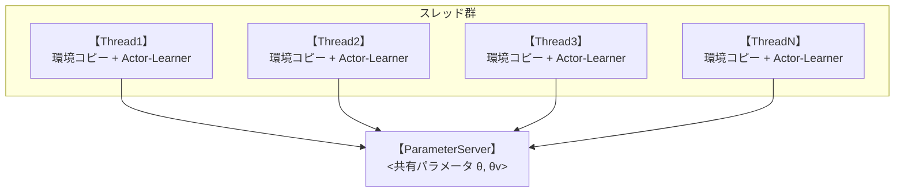

# Asynchronous Methods for Deep Reinforcement Learning（2016）

A3C は経験リプレイを使わずに，複数のエージェントによる非同期学習により安定化を図った，軽量で高速な深層強化学習手法

## 背景

## アーキテクチャ


```mermaid
graph TD
    PS["【ParameterServer】<br><共有パラメータ θ, θv>"]
    subgraph スレッド群
        T1["【Thread1】<br>環境コピー + Actor-Learner"]
        T2["【Thread2】<br>環境コピー + Actor-Learner"]
        T3["【Thread3】<br>環境コピー + Actor-Learner"]
        Tn["【ThreadN】<br>環境コピー + Actor-Learner"]
    end
    T1 --> PS
    T2 --> PS
    T3 --> PS
    Tn --> PS
```

Gorila

## 結果

- リスト 1
- リスト 2

```

```
