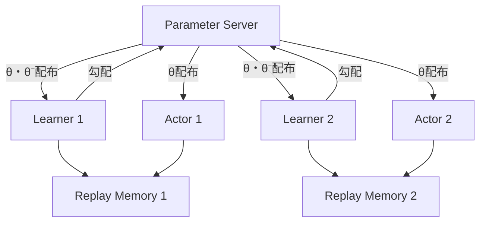
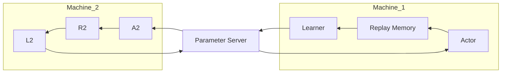
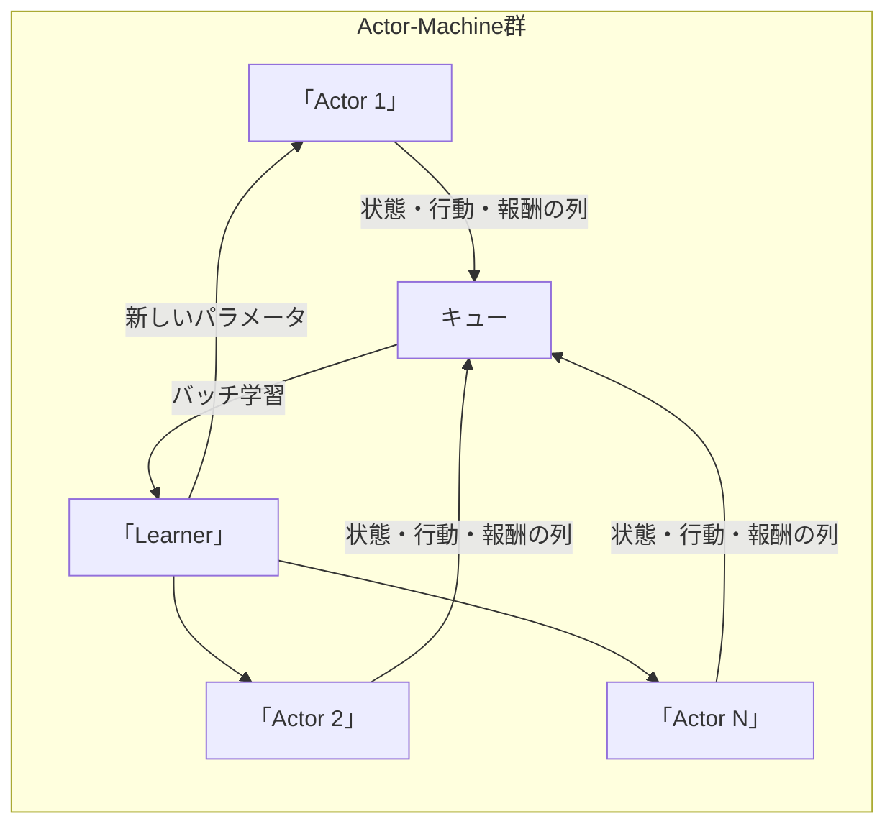

# Massively Parallel Methods for Deep Reinforcement Learning（2015）

Gorila という分散アーキテクチャにより，DQN を複数マシンで大規模並列実行し，学習時間を 1/10 に短縮しつつ性能を向上させた．

## 背景

今までの強化学習は，単一マシンで単一環境において学習を進めていた．しかしこれでは時間がかかる．
Actor と Learner を複数のマシンに分けて同時に動かす Gorila により，早くかつ賢く学習できるようにした．

##

- Actor：複数動作し，異なる状態を探索．
- Replay Memory：分散か単一かは構成による．
- Learner：DQN の損失で勾配計算し，Parameter Server に送信．
- Parameter Server：全体のパラメータ θ⁺ を保持し，非同期 SGD で更新．

