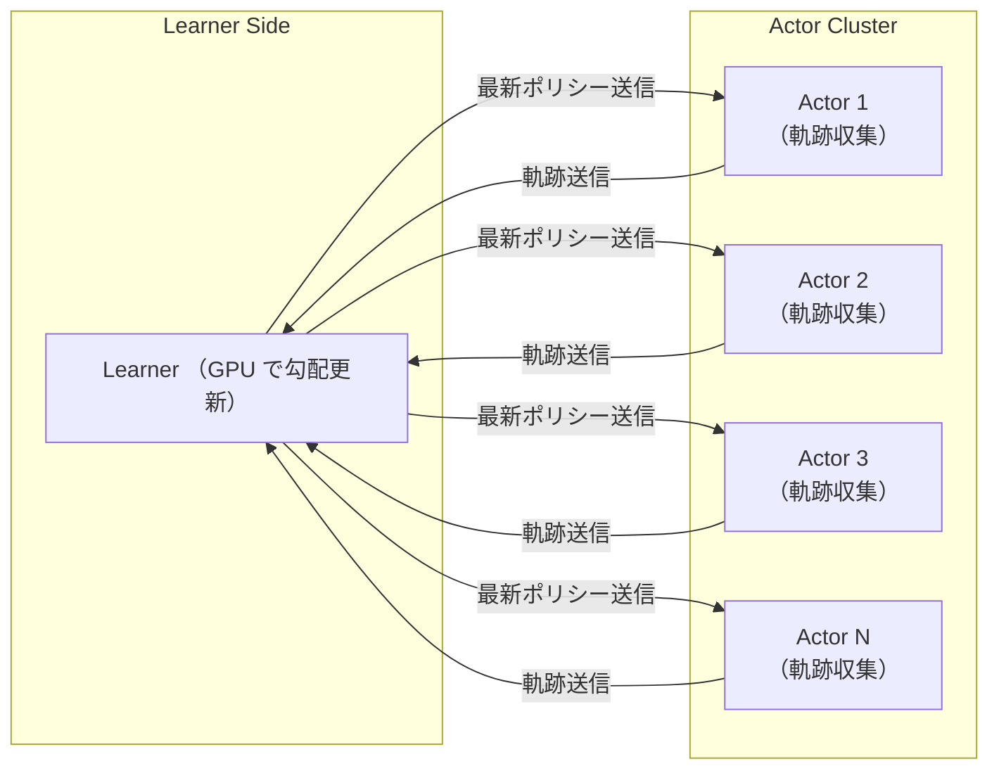

# IMPALA(Importance Weighted Actor-Learner Architecture):強化学習の分散アーキテクチャ

## IMPALA とは一言で？

大規模・多タスクな強化学習を安定かつ効率的に実行するための分散型エージェントである．

## IMPALA のアーキテクチャ

IMPALA は Actor が軌跡を収集し Learner が一括学習することで，高スループットかつ安定した分散学習を可能にする構成

Actor は環境と対話して状態・行動・報酬の軌跡を収集

- Learner は GPU 上でまとめて処理し，勾配更新
- Actor は学習には関与せず，周期的に最新のパラメータを取得
- 非同期かつ多対一の通信構造でスケーラブル
