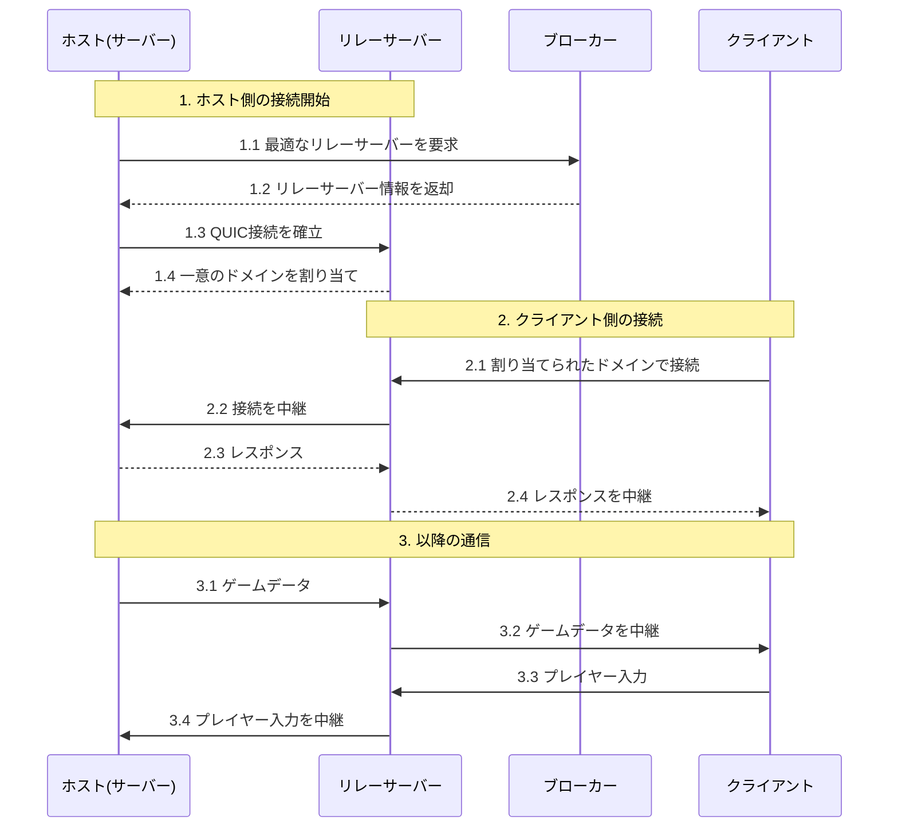

# .Jar ファイル(マインクラフト MOD)の解析をしてみた

## 背景

友人からマインクラフト Mod の紹介を受けた．どうやら Mod からマルチプレイ可能のホストを作成でき，NAT 越えも可能らしい．

> うちのルータだと Port 解放できないしどうせ無理だろうなぁ．．

できるらしい．その中身を記す．

### e4mc

[e4mc.link](https://e4mc.link/#)

## 解析

### 概要

CFR を利用してデコンパイルする．
brew を用いる場合，cfr-decompiler を使う．

### CFR のインストール

```bash
brew install cfr-decompiler
```

### デコンパイル

```bash
# デコンパイルしたソースコードを保存するディレクトリを作成
mkdir -p decompiled_source

# デコンパイル
cfr-decompiler e4mc_minecraft-fabric-5.3.1.jar --outputdir decompiled_source
```

### デコンパイルしたソースコードの確認

HTTP リクエストを送信する
QuiclimeSession.java

```java
HttpRequest request = HttpRequest.newBuilder(new URI(Config.INSTANCE.brokerUrl.value()))
    .header("Accept", "application/json")
    .build();
```

対象を決定する

```java
BrokerResponse resp = new BrokerResponse();
resp.id = "custom";
resp.host = Config.INSTANCE.relayHost.value();
resp.port = Config.INSTANCE.relayPort.value();
```

config.java

```java
public class Config
extends ReflectiveConfig {
    public static final Config INSTANCE = (Config)Config.createToml((Path)Agnos.configDir(), (String)"e4mc", (String)"e4mc", Config.class);
    @Comment(value={"Whether to use the broker to get the best relay based on location or use a hard-coded relay."})
    public final TrackedValue<Boolean> useBroker = this.value(true);
    public final TrackedValue<String> brokerUrl = this.value("https://broker.e4mc.link/getBestRelay");
    public final TrackedValue<String> relayHost = this.value("test.e4mc.link");
    public final TrackedValue<Integer> relayPort = this.value(25575);
}
```

https://broker.e4mc.link/getBestRelayにアクセスすると，その地域で一番良いサーバ名が帰ってくる．

## 調査結果

誰かがリレーサーバを運用してくれているッ...!!

> ようするに誰かが AWS の VPC みたいなものを無料で使わせてくれている．<br>
> 似ている技術としては，Ngrok があげられる

### 仕組みの構成図



### 余談

マンション済が NFS サーバ使うのにリレーサーバとか使われるよなぁ

## 最後に

ほんとにありがとうございます．使いたくなったら使います．どうか有料にしないでください．
