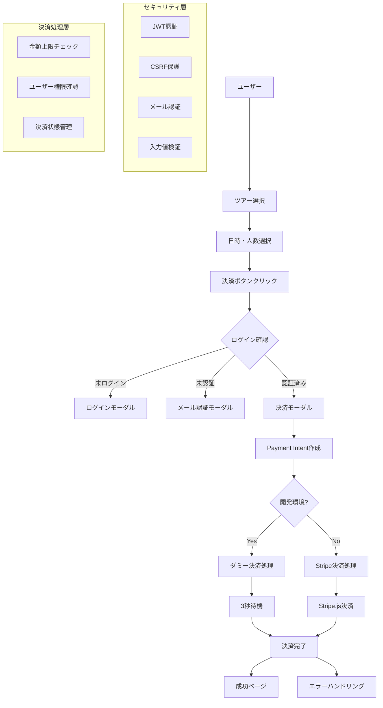

# 作業ログ - Stripe 決済システム実装

## Stripe の API の仕様と使い方

### 主要な API エンドポイント

#### 1. Payment Intent API

- **目的**: 決済の意図を表現し、決済フローを管理
- **使用場面**: 決済処理の開始時に作成
- **主要パラメータ**:
  ```typescript
  {
    amount: number,        // 金額
    currency: "jpy",       // 通貨コード
    metadata: {           // カスタムメタデータ
      userId: string,
      tourId: string,
      selectedDate: string,
      participants: string
    },
    automatic_payment_methods: {
      enabled: true       // 自動決済方法の有効化
    }
  }
  ```

#### 2. 決済確認 API

- **目的**: 決済の状態を確認し、成功/失敗を判定
- **使用場面**: 決済完了後の状態確認
- **戻り値**: Payment Intent オブジェクト（status, amount, metadata 等）

#### 3. 決済キャンセル API

- **目的**: 進行中の決済をキャンセル
- **使用場面**: ユーザーによる決済キャンセル時

### 決済フロー

1. **Payment Intent 作成** → サーバーサイド
2. **クライアントサイド決済** → Stripe.js
3. **決済状態確認** → サーバーサイド
4. **結果処理** → 成功/失敗に応じた処理

## 追加した処理機構の概要



## 実際の処理フロー・内容

### 1. フロントエンド処理（StripePaymentForm.tsx）

```typescript
// 決済フローの主要ステップ
const handleSubmit = async (event: React.FormEvent) => {
  // 1. 開発環境判定
  if (isDevelopment && isDummyKey) {
    // ダミー決済処理
    await createPaymentIntent();
    await delay(3000);
    onSuccess();
    return;
  }

  // 2. 本番決済処理
  const clientSecret = await createPaymentIntent();
  const { error } = await stripe.confirmCardPayment(clientSecret, {
    payment_method: {
      card: elements.getElement(CardElement)!,
      billing_details: { name, email },
    },
  });

  // 3. 結果処理
  if (error) throw new Error(error.message);
  onSuccess();
};
```

### 2. バックエンド処理（create-intent/route.ts）

```typescript
export async function POST(request: NextRequest) {
  // 1. 認証確認
  const authToken = request.cookies.get("auth-token")?.value;
  const user = verifyToken(authToken);

  // 2. メール認証確認
  if (!user.emailVerified) {
    return NextResponse.json(
      { error: "メール認証が必要です" },
      { status: 403 }
    );
  }

  // 3. CSRF保護（本番環境のみ）
  if (process.env.NODE_ENV === "production") {
    // CSRFトークン検証
  }

  // 4. 入力値検証
  const { amount, tourId, tourTitle, selectedDate, participants } =
    await request.json();

  // 5. 金額上限チェック
  if (amount > 1000000) {
    return NextResponse.json(
      { error: "決済金額が上限を超えています" },
      { status: 400 }
    );
  }

  // 6. Payment Intent作成
  const paymentIntent = await createPaymentIntent(amount, "jpy", {
    userId: user.id,
    userEmail: user.email,
    tourId,
    tourTitle,
    selectedDate,
    participants: participants.toString(),
  });

  return NextResponse.json({
    success: true,
    clientSecret: paymentIntent.client_secret,
    paymentIntentId: paymentIntent.id,
  });
}
```

### 3. 決済確認処理（confirm/route.ts）

```typescript
export async function POST(request: NextRequest) {
  // 1. 認証・権限確認
  const user = verifyToken(authToken);
  const paymentIntent = await getPaymentIntent(paymentIntentId);

  // 2. ユーザー権限確認
  if (paymentIntent.metadata.userId !== user.id) {
    return NextResponse.json({ error: "権限がありません" }, { status: 403 });
  }

  // 3. 決済状態判定
  if (isPaymentSuccessful(paymentIntent)) {
    // 成功処理
    return NextResponse.json({ success: true, status: "succeeded" });
  } else if (isPaymentFailed(paymentIntent)) {
    // 失敗処理
    return NextResponse.json({ success: false, status: paymentIntent.status });
  }
}
```

## 期待される返答（OK/BAD）

### 正常なレスポンス例

#### Payment Intent 作成成功

```json
{
  "success": true,
  "clientSecret": "pi_xxx_secret_xxx",
  "paymentIntentId": "pi_xxx"
}
```

#### 決済確認成功

```json
{
  "success": true,
  "status": "succeeded",
  "message": "決済が完了しました",
  "paymentIntent": {
    "id": "pi_xxx",
    "amount": 50000,
    "currency": "jpy",
    "status": "succeeded",
    "metadata": {
      "userId": "1",
      "tourId": "tour1",
      "selectedDate": "2024-01-15",
      "participants": "2"
    }
  }
}
```

### エラーレスポンス例

#### 認証エラー

```json
{
  "error": "認証が必要です"
}
```

#### メール認証未完了

```json
{
  "error": "メール認証が必要です"
}
```

#### 入力値エラー

```json
{
  "error": "有効な金額を入力してください"
}
```

#### 権限エラー

```json
{
  "error": "この決済を確認する権限がありません"
}
```

## 実運用との乖離（簡約化した点）

### 1. データベース連携

- **現状**: ダミーユーザーデータ（ハードコード）
- **実運用**: Firestore/PostgreSQL 等のデータベース連携
- **必要な実装**: ユーザー管理、予約管理、決済履歴管理

### 2. 決済履歴管理

- **現状**: 決済完了後のデータ保存なし
- **実運用**: 決済履歴の永続化、予約データの作成
- **必要な実装**: データベーススキーマ設計、CRUD 操作

### 3. エラーハンドリング

- **現状**: 基本的なエラーメッセージのみ
- **実運用**: 詳細なエラーログ、監視システム
- **必要な実装**: ログ集約、アラート機能

### 4. 決済方法の多様化

- **現状**: クレジットカードのみ
- **実運用**: 銀行振込、コンビニ決済、電子マネー等
- **必要な実装**: 複数決済方法の統合

### 5. 在庫管理

- **現状**: 在庫チェックなし
- **実運用**: リアルタイム在庫管理、予約可能数の制限
- **必要な実装**: 在庫管理システム

## セキュリティ対策列挙

### 実装済みセキュリティ対策

#### 1. 認証・認可

- ✅ JWT ベースの認証システム
- ✅ セッション管理（httpOnly クッキー）
- ✅ メール認証（2FA）
- ✅ ユーザー権限確認

#### 2. 決済セキュリティ

- ✅ Stripe Payment Intent 使用
- ✅ サーバーサイドでの決済処理
- ✅ 決済状態の適切な管理
- ✅ 金額上限チェック（1,000,000 円）

#### 3. 入力値検証

- ✅ 必須項目チェック
- ✅ データ型検証
- ✅ 金額範囲チェック
- ✅ XSS 対策（React の自動エスケープ）

#### 4. CSRF 保護

- ✅ CSRF トークン生成・検証
- ✅ SameSite クッキー設定
- ✅ 開発環境での緩和設定

#### 5. エラーハンドリング

- ✅ 適切なエラーレスポンス
- ✅ 機密情報の漏洩防止
- ✅ ログ出力制御

### 今後強化すべきセキュリティ

#### 1. レート制限

```typescript
// 実装が必要
const rateLimit = {
  windowMs: 15 * 60 * 1000, // 15分
  max: 100, // 最大リクエスト数
  message: "リクエストが多すぎます",
};
```

#### 2. 入力値サニタイゼーション

```typescript
// 実装が必要
import DOMPurify from "dompurify";
const sanitizedInput = DOMPurify.sanitize(userInput);
```

#### 3. SQL インジェクション対策

```typescript
// Firestore使用時は自動で対策済み
// 他のDB使用時はパラメータ化クエリ必須
```

#### 4. セキュリティヘッダー

```typescript
// next.config.tsで実装が必要
const securityHeaders = [
  {
    key: "X-Frame-Options",
    value: "DENY",
  },
  {
    key: "X-Content-Type-Options",
    value: "nosniff",
  },
  {
    key: "Referrer-Policy",
    value: "strict-origin-when-cross-origin",
  },
];
```

#### 5. 監査ログ

```typescript
// 実装が必要
interface AuditLog {
  userId: string;
  action: string;
  timestamp: Date;
  ipAddress: string;
  userAgent: string;
  details: any;
}
```

#### 6. 決済監視

```typescript
// 実装が必要
interface PaymentMonitor {
  suspiciousAmounts: number[];
  unusualPatterns: string[];
  fraudDetection: boolean;
}
```

#### 7. データ暗号化

```typescript
// 実装が必要
import crypto from "crypto";
const encryptSensitiveData = (data: string) => {
  // AES暗号化実装
};
```

#### 8. セッション管理強化

```typescript
// 実装が必要
interface SessionConfig {
  maxAge: number;
  secure: boolean;
  httpOnly: boolean;
  sameSite: "strict" | "lax" | "none";
  rolling: boolean;
}
```

### 本番環境での追加推奨事項

1. **HTTPS 強制**
2. **HSTS ヘッダー設定**
3. **CSP（Content Security Policy）設定**
4. **定期的なセキュリティ監査**
5. **ペネトレーションテスト**
6. **脆弱性スキャン**
7. **バックアップ・復旧計画**
8. **インシデント対応計画**

---

## 技術スタック詳細

- **フロントエンド**: Next.js 15, React 19, TypeScript
- **スタイリング**: Tailwind CSS
- **認証**: JWT, bcryptjs
- **決済**: Stripe API v2025-06-30.basil
- **開発環境**: Turbopack, ESLint
- **デプロイ**: Firebase Hosting（予定）

## 開発環境での動作確認

```bash
# 開発サーバー起動
npm run dev

# テスト用アカウント
Email: test@example.com
Password: password123

# テスト用カード
Number: 4242 4242 4242 4242
Expiry: 12/25
CVC: 123
```

---

_最終更新: 2024 年 12 月_

ログインせずに決済ページにアクセスすると、ログインページにリダイレクトされる。

```
curl -X POST http://localhost:3000/api/auth/login/ -H "Content-Type: application/json" -d '{"email":"test@example.com","password":"password123"}' -c cookies.txt -v
```

```
< set-cookie: auth-token=eyJhbGciOiJIUzI1NiIsInR5cCI6IkpXVCJ9.eyJpZCI6IjEiLCJlbWFpbCI6InRlc3RAZXhhbXBsZS5jb2
0iLCJlbWFpbFZlcmlmaWVkIjp0cnVlLCJpYXQiOjE3NTM4NjQ3MTYsImV4cCI6MTc1Mzk1MTExNn0.4r9to9CxGTnqn3eRQ0k4Sh5heJvW4j
ANM2Ag6ottP68; Path=/; Expires=Thu, 31 Jul 2025 08:38:36 GMT; Max-Age=86400; HttpOnly; SameSite=strict
* Added cookie csrf-token="kd7k0id9t1lkqd16w1cbb" for domain localhost, path /, expire 1753951116
< set-cookie: csrf-token=kd7k0id9t1lkqd16w1cbb; Path=/; Expires=Thu, 31 Jul 2025 08:38:36 GMT; Max-Age=86400
; SameSite=strict
< Date: Wed, 30 Jul 2025 08:38:36 GMT
< Connection: keep-alive
< Keep-Alive: timeout=5
< Transfer-Encoding: chunked
<
* Connection #0 to host localhost left intact
{"success":true,"user":{"id":"1","email":"test@example.com","name":"テストユーザー","emailVerified":true},"t
oken":"eyJhbGciOiJIUzI1NiIsInR5cCI6IkpXVCJ9.eyJpZCI6IjEiLCJlbWFpbCI6InRlc3RAZXhhbXBsZS5jb20iLCJlbWFpbFZlcmlm
aWVkIjp0cnVlLCJpYXQiOjE3NTM4NjQ3MTYsImV4cCI6MTc1Mzk1MTExNn0.4r9to9CxGTnqn3eRQ0k4Sh5heJvW4jANM2Ag6ottP68","cs
rfToken":"kd7k0id9t1lkqd16w1cbb"}
```

決済テスト

```
url -X POST http://localhost:3000/api/payment/create-intent/ -H "Content-Type: application/json" -H "x-csrf-token: kd7k0id9t1lkqd16w1cbb" -b cookies.txt -d '{"amount":50000,"tourId":"tour1","tourTitle":"東京観光ツアー","selectedDate":"2024-01-15","participants":2}'
```

```
{
  "success": true,
  "clientSecret": "pi_3RqVX42Llpj41XuZ1ALPgUsk_secret_Y7ZI5Ykb9GGpIzrRDlyUOiuqF",
  "paymentIntentId": "pi_3RqVX42Llpj41XuZ1ALPgUsk"
}
```

レート埋め込み from TripAdvisor
