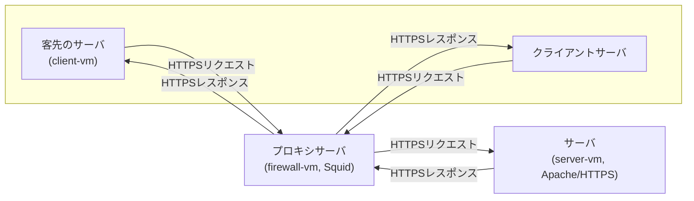

# Squid 越し HTTPS を治そう（All I Want for Christmas are … writeup）

## 概要

Squid Proxy を介した  
`https://server.example.local` への HTTPS 通信が **不安定に失敗する**という事象に対応した．

問い合わせ元のクライアントからは **3 ～ 4 秒おきに定期的なアクセス**が発生しているにもかかわらず，

- 成功する回（HTTP 200）
- TLS ハンドシェイク途中で失敗する回（`SSL_ERROR_SYSCALL`）

が混在する状態であった．

最終的に **完全な安定化には至らなかった**が，  
ログを追い続けることで，問題の性質と切り分け結果はいくつか明確になった．  
本稿では「分かったこと」「否定できた可能性」「怪しい点」を整理して残す．

## 環境概要（再掲）

- 上段右: 客先のサーバ
  - 明示型プロキシとして Squid を利用
- 上段左: クライアント模擬サーバ（client-vm）
- プロキシサーバ（firewall-vm, Squid 稼働, 複数 NIC: 192.168.30.1 / .129 / .133 など）
- サーバ（server-vm, Apache による HTTPS サーバ）



制約として，

- Squid を経由しない通信は禁止
- 宛先を全許可する設定は禁止
- IP / routing の変更は禁止
- ユーザ権限変更は禁止

という条件があった．

---

## 問題の再現

### TLS ハンドシェイクでの失敗

client-vm から Squid 経由でアクセスすると，

```bash
curl -v --proxy http://192.168.30.1:3128 https://server.example.local/
```

失敗時は以下のような挙動を示した：

- HTTP CONNECT は成功（`200 Connection established`）
- TLS ClientHello 送信後に停止
- `SSL_ERROR_SYSCALL` で終了

このため，

- HTTP CONNECT の拒否
- ACL による outright deny

ではなく，**TLS ハンドシェイク前後の問題**であることが分かった．

---

### 3 秒おき × 複数回テスト

問い合わせ元の状況に合わせ，3 秒おきに連続アクセスを実施した．

```bash
while true; do
  curl -sS --proxy http://192.168.30.1:3128 \
    -o /dev/null -w "HTTP=%{http_code}\n" \
    https://server.example.local/
  sleep 3
done
```

結果：

- HTTP=200 が出る回もある
- その直後に HTTP=000 + SSL_ERROR_SYSCALL が出ることもある
- 完全にランダムではないが，再現性も高くない

→ **「たまに失敗する」ではなく，「成功と失敗が交互に混在する」状態**

---

## ログから分かったこと

### Squid access.log

`/var/log/squid/access.log` を見ると，以下が混在していた．

```
TCP_TUNNEL/200   CONNECT server.example.local:443
NONE_NONE/503    CONNECT server.example.local:443
```

- `TCP_TUNNEL/200`

  - トンネル確立成功
  - 実際にデータ転送が行われている

- `NONE_NONE/503`

  - Squid が上流（server:443）への接続に失敗

特に注目すべき点は：

- `503` までの所要時間が **約 3000ms 前後**
- これは Squid の **上流接続タイムアウト系挙動**と一致する

---

### Squid cache.log

`/var/log/squid/cache.log` では，失敗時に以下のようなログが観測された．

```
TLS error: failed to allocate handle
ERROR: could not create TLS server context
```

- Squid が クライアント向け TLS コンテキストを生成しようとして失敗
- 本来 splice したい通信なのに，SSL Bump 側に入ってしまった可能性

## 否定できた可能性

ログと挙動から，以下は可能性が低いと判断できた．

- server-vm（Apache）の設定不備
  → server-vm では **常に 200 が返っており安定**
- クライアント証明書検証の問題
  → `-k` を付けても失敗する回がある
- HTTP ACL（CONNECT deny）
  → CONNECT 自体は毎回 200 で成功

## 怪しいポイント

### 1. SSL Bump の分岐不整合

- `peek` は行われている
- `splice` の条件や評価段階が曖昧
- 結果として **splice される回 / bump 側に入る回が混在**

特に，

- `NONE_NONE/503` が出る回では
- Squid が **上流接続を自分で張ろうとして失敗**
- その結果 TLS ハンドシェイクが途中で落ちる

という流れが，ログ上は一貫して見えた．

---

## 試したこと（未解決）

- SSL Bump の step 明示（SslBump1 / SslBump2）
- `tcp_outgoing_address` による送信元 IP 固定
- Squid reload / parse / restart による設定確認

---

## まとめ

今回の対応で分かったことは以下である．

- 問題は HTTP ではなく **TLS ハンドシェイク周辺**
- server や client 単体ではなく **Squid を介した経路依存**
- 成功・失敗が混在する点から，

  - SSL Bump 分岐の揺れ
  - 上流接続経路の不安定さ

    のどちらか，あるいは両方が関与している可能性が高い．
